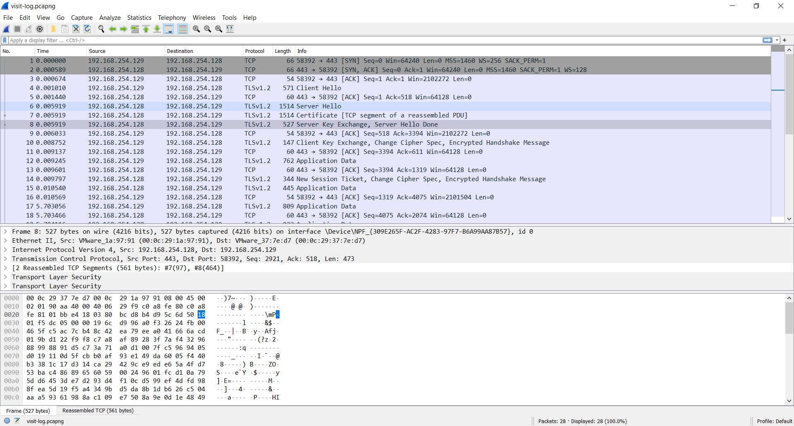
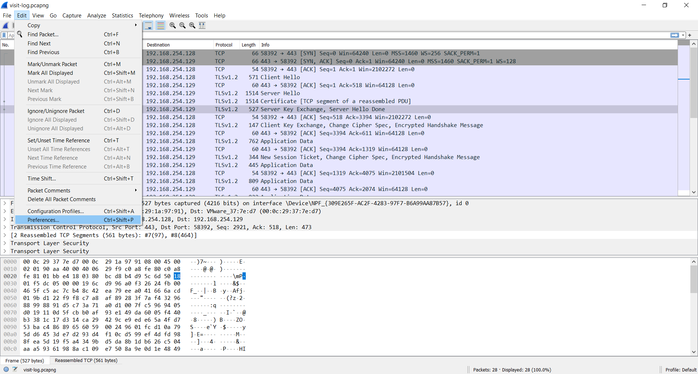
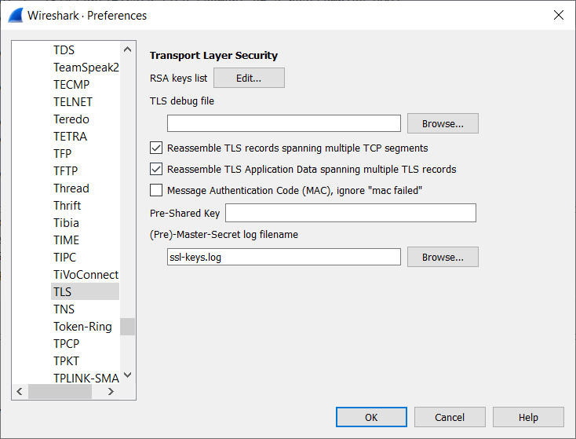
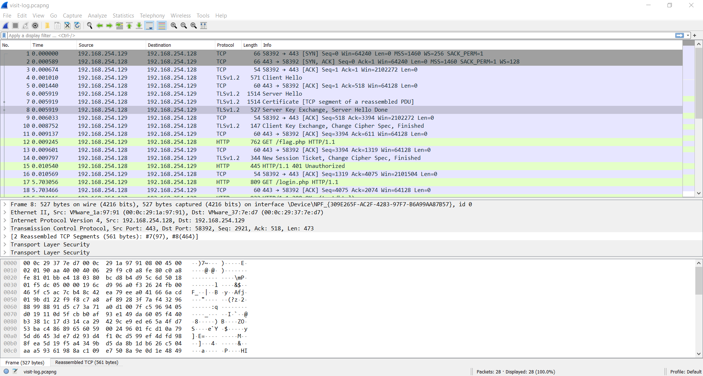
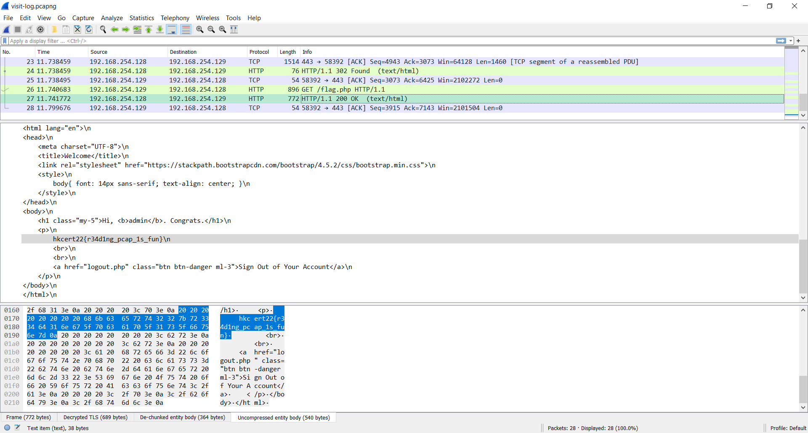

# Solution

## Tools

* [Wireshark](https://www.wireshark.org/download.html)

## Train of thought

Two files are provided in this challenge:
1.	PCAP
2.	SSL session key

We may decude that this challenge will require both files for TLS decrypt.

### Open PCAP

Once we downloaded Wireshark and open it up, we may see it contains the TLS traffic. These traffic are encrypted and we cannot read the flow directly.

### Key Import

By doing so, the data will be decrypted. Note the change in PCAP.

### Read Flag

From the description, the flag is hide in `/flag.php`. Row 13 and 15 shows an error 401 and no data is returned.
However, row 27 shows an success login attempt and flag is obtained.

## Flag
`hkcert22{r34d1ng_pcap_1s_fun}`
