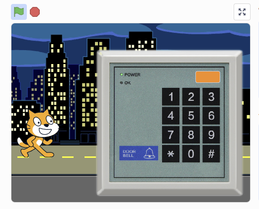
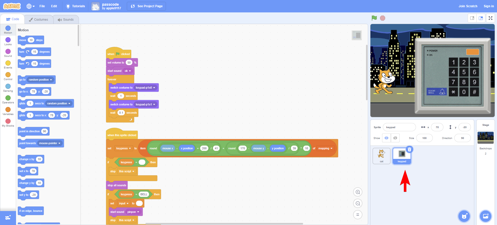
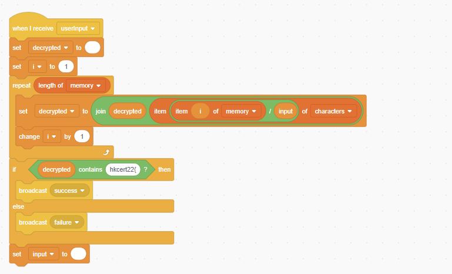
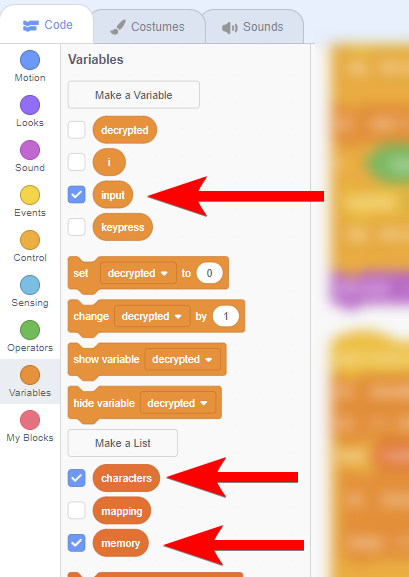
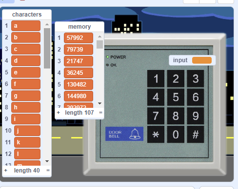
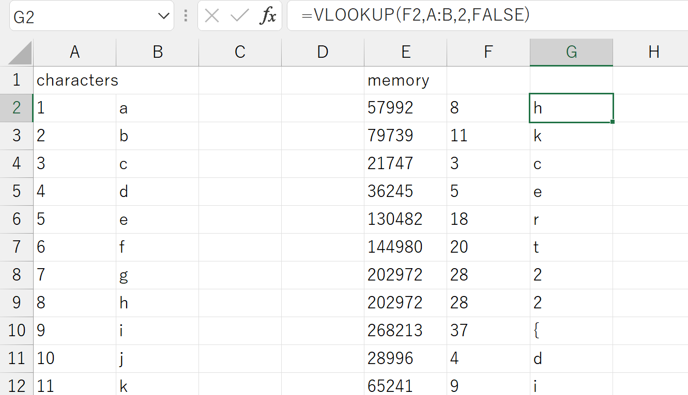

# Scratch passcode - Solution

The scratch passcode is a scratch game that require user to input a 4-digits passcode to the keypad, and if it is correct it will return the flag.



So how can we crack the passcode? 

The scratch program won't know what is a correct passcode, unless it is programmed to do so. Therefore, we can view its source code and find out how it knows what is a correct passcode, and we can hack in to it! 

Click "View Inside" button of the project page.



The program is short but could be complex for beginners. What to look for? Well, if you tried entering a few wrong passcodes you would know it will error and have a special sound and graphic effect. We could start from the success / failure indication, then find the PIN code checking logic from that.

You should discover this code snippet:



When `userinput`, it will do some calculation, and `if <decrypted> contains "hkcert22{", then success`. Sounds like it performs 'decryption' on the flag based on the PIN code?

Look carefully on the line 5 (`set decrypted to ...`), it is trying to divide each item in `memory` by `input`. What are they? Let's show the variables:



So `memory` contains some large numbers, and the input is the passcode inputted.



Let's right-click and export them out to Excel for easier processing.

## Encoding

In this scratch program, it is representing characters in numbers. We had the characters table which looks like this:

```
1	a
2	b
3	c
4	d
5	e
6	f
7	g
8	h
...
34	8
35	9
36	0
37	{
38	}
39	-
40	_
```

Which in line 5 `item {...} of <characters>`, it will get the corresponding character by the number ("index").

In real life, computer works in numbers too. We had a [ASCII encoding table](https://en.wikipedia.org/wiki/ASCII) to map characters into numbers, it looks like:

```
141	a
142	b
143	c
...
```

## Multiplication

So in line 5, the program divide the encrypted numbers (`memory`) by our PIN input (`input`), one by one, then map it into alphabets base on the `characters` table and check if it contains `hkcert22`.

A educated guess would be the `memory` contains the flag. Let's look at the first three number in `memory`:

```
57992
79739
21747
```

In our assumption, the `memory` contains the flag, it would start by `hkcert22`, that means `57992 = 'h'` and `79739 = 'k'`, and so on.

How to get the PIN code?

Well, the encryption process is just multiplication, and `'h' = 8`, so to get the PIN code you can just:

```
57992 / 8 = 7249
```

For second letter: `79739 / 7249 = 11 = 'k'`.

So we verified our assumption and you got the passcode. Congrats!

## Excel

We just cracked the PIN code by hand, and you can just input the number into the keypad to get the flag, but you can also use [Excel](./passcode.xlsx) to help on your calculation.


