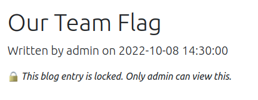

# Write-up

## Challenge Background

We are given a link to a web blog and its source code. In the blog, there is a locked blog post, which can be viewed only if the user is signed in as _admin_.



Moreover, there are multiple features on the site:

- view blog posts
- log in as a user
- reset password on behalf on a user

### Getting Started

The source code for the login endpoint is simple, as given in `app.js`:

```javascript
app.post('/login', function (req, res) {
  const currentUser = req.user
  const { username, password } = req.body

  const user = getUserByUsernameAndPassword(username, password)
  if (!user) {
    return res.render('login', {
      currentUser,
      errorMessage: 'Your username or password is incorrect.'
    })
  }

  const token = signToken(user)
  res.cookie('elb2_token', token)

  return res.render('login', {
    currentUser,
    successMessage: 'Logged in successfully.'
  })
})
```

However, `getUserByUsernameAndPassword` uses `safeEqual`. This function is a bit suspicious...

```javascript
/**
 * safeEqual checks if the given strings are identical. Runs in constant time,
 * which should be invulnerable from timing attacks.
 * References:
 * - https://securitypitfalls.wordpress.com/2018/08/03/constant-time-compare-in-python/
 * - https://www.chosenplaintext.ca/articles/beginners-guide-constant-time-cryptography.html
 * 
 * @param {string} a
 * @param {string} b
 * @returns a boolean indicating whether the two strings are equal.
 */
function safeEqual (a, b) {
  let isEqual = true

  if (a.length !== b.length) return false

  for (let i = 0; i < a.length; i++) isEqual &&= a.indexOf(i) == b.indexOf(i)
  return isEqual
}
```

Ideally `safeEqual` should be implemented such that the check is performed in constant time (not in $\mathcal{O}(1)$ as suggested in complexity theory, but the running time should be "consistent" such that attackers cannot recover the password from the running time of the function).

### Fantastic `safeEqual` and How to Exploit It

In short, it checks if `a[0] == b[0]` and `a[1] == b[1]` and so on; and it does _not_ return early when it finds a mismatch. In that way, the number of checks would be the same... Unfortunately the check is different from what I mentioned.

`a.indexOf(i)` returns `-1` if `i` is not a substring of `a`, and the index of the first occurrance of `i` otherwise. For example:

```javascript
//      * 7th character, zero-indexed 
'9RC+xEH3AfCfHnLojEmHLkpQ6kM='.indexOf(3) == 7

// '5' is not its substring
'9RC+xEH3AfCfHnLojEmHLkpQ6kM='.indexOf(5) == -1
```

Recall that the `safeEqual` function takes two base64-encoded SHA1 digests, which composes of 27 characters from `A-Z`, `a-z`, `0-9`, `+` and `/`, followed by one `=`. It is easy to generate passwords with its hash without `0-9`, the probability would be $(54/64)^{27} \approx 1.018\%$, which is around 1 in 100.

### Signing in as the Admin

We can write a Python snippet to generate such passwords:

```python
import os, base64, hashlib

while True:
    # Generates a 16-character password, where each letter being 0-9 or a-f.
    password = os.urandom(8).hex()
    # Computes the SHA-1 hash of the password and encode it in base64.
    h = base64.b64encode(hashlib.sha1(password.encode()).digest())  
    # Checks if the digest has any of the 0, 1, ..., 9.
    # If not, then we will use that as the password.
    if len(set(h) & set(b'0123456789')) == 0: break
  
print(f'{password = }')
```

One password generated would be `b2180010404f4d2c` and it's SHA-1 digest is `oR+kxuWBMBia+ndR+SWXbRJbw/o=`. It does not contain `0`, `1`, ..., nor `9`!

On the other hand, we will need to reset the admin's password until their hash does not contain 0-9 as well. This is the approach to attack, after all:

1. Generate a password $p$ with its SHA-1 digest not having any of the numeral digits.
2. Reset the admin's password and sign in to admin's account with the password $p$... Repeat until it works (this takes around 100 times).