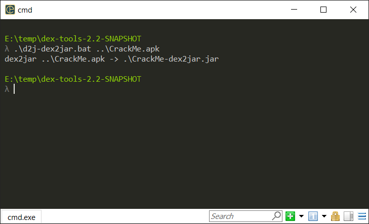
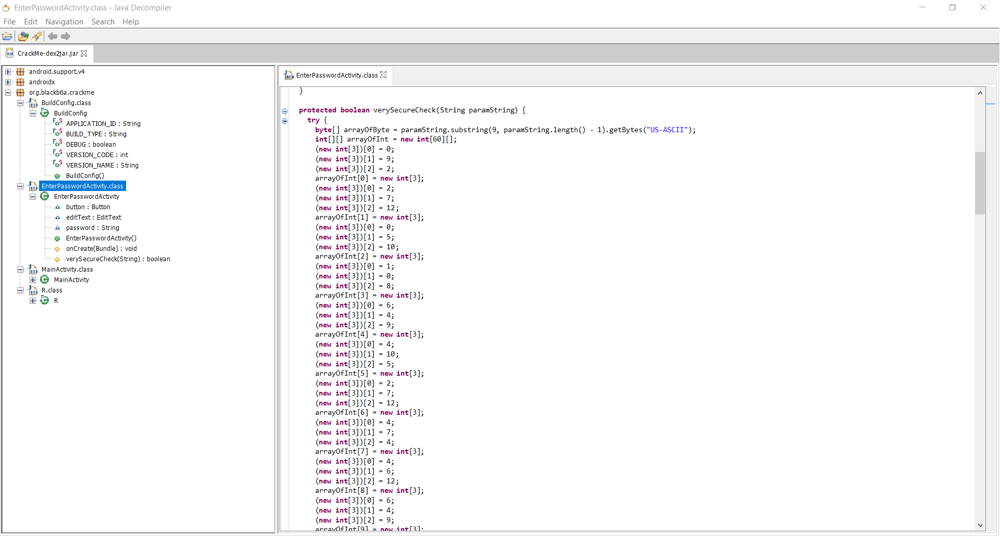
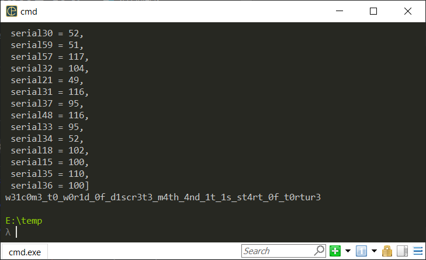

# Write-up

## Prologue
This chal is aiming ask participants to decompile and use z3 to recover the flag.

## Replay
Use `dex-tool` to convert APK to jar. You can download the tool [here](https://github.com/pxb1988/dex2jar/releases/tag/v2.2-SNAPSHOT-2021-10-31).

```cmd
.\d2j-dex2jar.bat ..\CrackMe.apk
```


Use `jd-gui` for decompiling jar (`EnterPasswordActivity.class`), you may see the logic handling flag checking:


Use `z3` to solve the SMT, or it's simple enough to do it by handling. Check out `sol.py` for z3 usage.


However, the inverse modular does not include the flag format. The inverse modular only handle strings within the bracket. Add the flag format as mentioned in `EnterPasswordActivity.class` (note the `substring` function). 

## Flag

`hkcert22{w31c0m3_t0_w0r1d_0f_d1scr3t3_m4th_4nd_1t_1s_st4rt_0f_t0rtur}`

## Epilogue
Andriod Studio sucks.