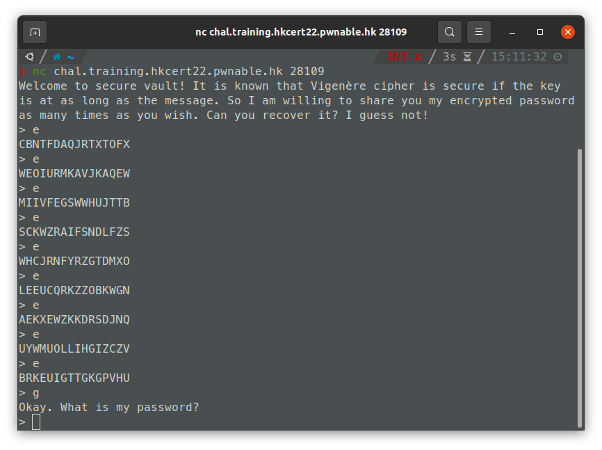
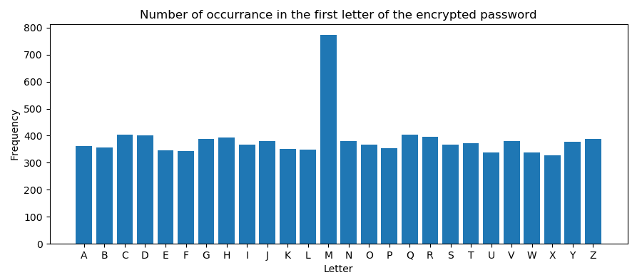

# Write-up

## Challenge Background

There is a `netcat` service hosted. When connected, a 16-letter password (in all caps) is generated.

When we send a `e` to the server, we can get a password encrypted with a brand new 16-letter key. We can also guess the password by sending `g`; if our guess is correct, they will send us the flag.



### Issues in the Key Generation Function

The key generation function, `generate_key`, is simple:

```python
# Generates n numbers randomly, from [0, 1, ..., 25].
def generate_key(n):
    return [random.randint(0, 26) for _ in range(n)]
```

One problem is the `random.randint` uses MT19937, which is recoverable when we obtain sufficient information about the internal states. However this is out of scope of what we are discussing, as it is pretty advanced with respect to the training.

Another problem is, the use of `random.randint` is actually incorrect. According to [the documentation](https://docs.python.org/3/library/random.html#random.randint), the integer returned from `random.randint(0, 26)` should be $n$ with $0 \leq n \leq 26$, instead of $0 \leq n < 26$. Since 0 is equal to 26 under modulo 26, it is twice likely for $k = 0$ to be used, relatively to $k = 1, k = 2, ..., k = 25$.

## Recovering the Password

To recover the password, we can collect a lot of (for instance, 10000) encrypted passwords. We then can count the number of each letter in each of the positions.

For example, this is a number of occurrances of the characters as the first letter of the encrypted password.



We can see that there are around 800 encrypted passwords that start with a `M`, which is significantly higher than the remaining letters. Therefore, we can claim that `M` is the ciphertext when encrypted with $k = 0$; and it's plaintext, is also `M`.

Repeat the process for the remaining letters, we can fully recover the password.