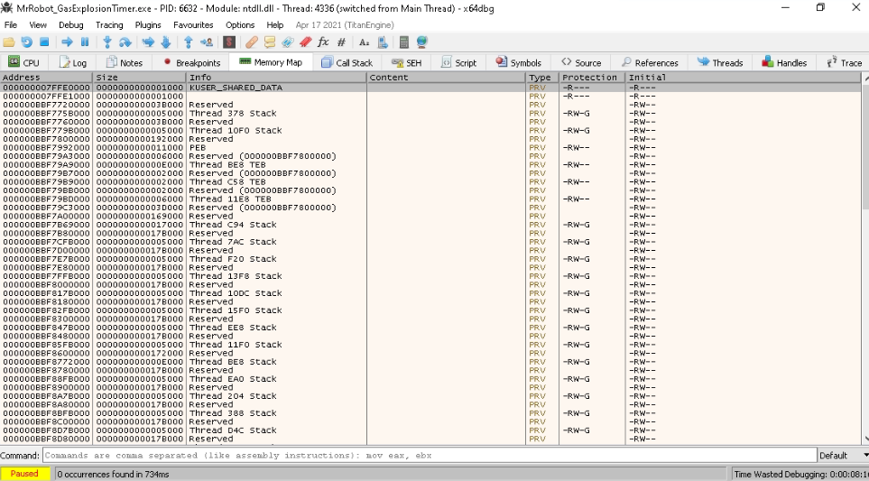
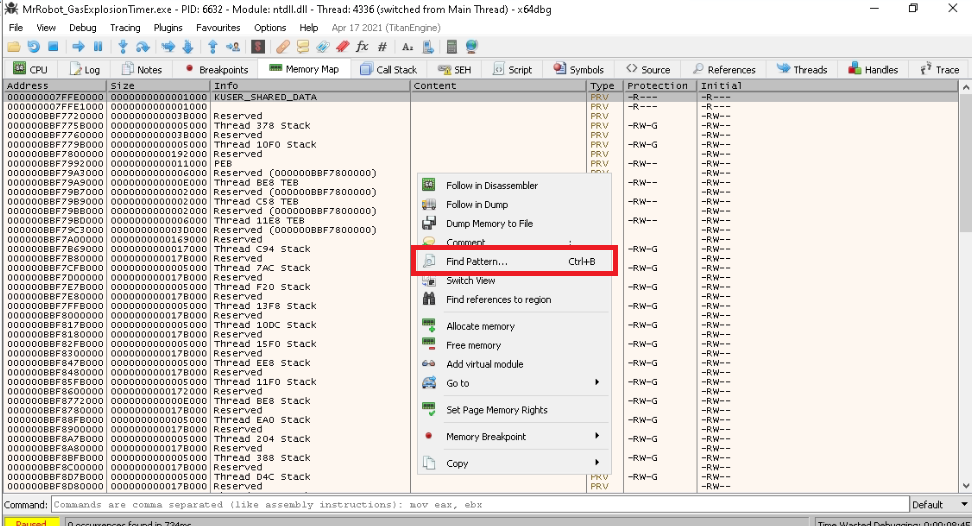
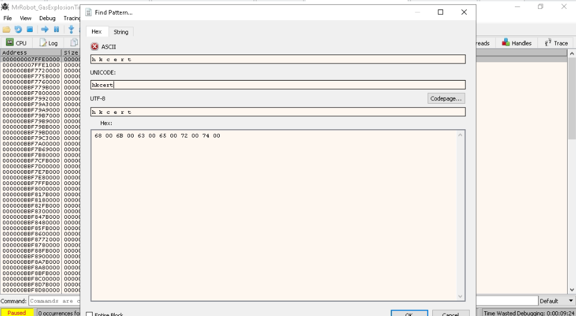
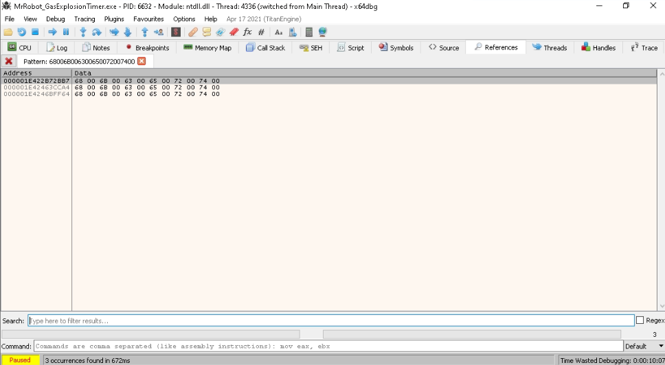
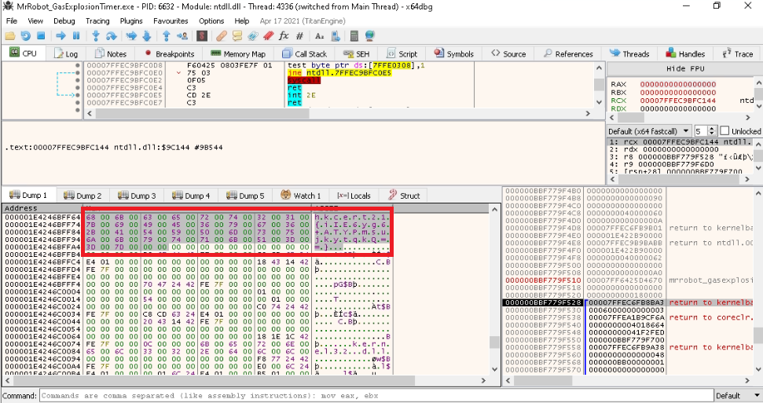

## Write-up


1. Load the given exe to x64dbg and run the exe 

2. Wait until ```Timebomb deactivation key``` appears in the console and break the execution from x64dbg

3. Click the Memory Map tab and right-click ```Find Pattern```





4. Input ```hkcert``` (flag format) in the Unicode console 



5. Examine the result 






## Flag 

```
hkcert21{iIE6yg6+ATYPmsujkytqkQ==}
```

