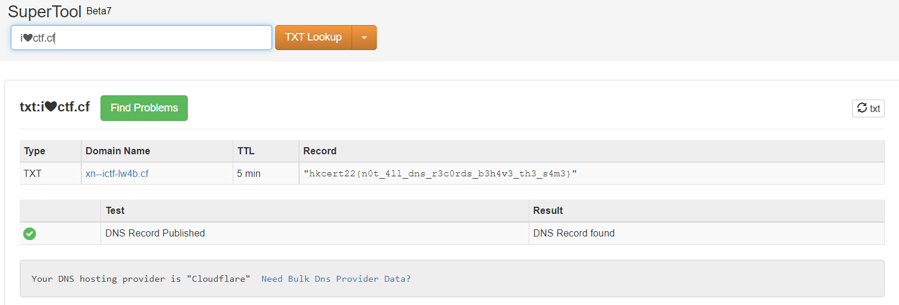

# Solution

## Tools

* [DNS Lookup](https://mxtoolbox.com/DNSLookup.aspx)

## Flow

1.	Visit [DNS Lookup](https://mxtoolbox.com/DNSLookup.aspx) and choose "TXT Lookup".
2.	Enter the domain "i❤ctf.cf".
3.	Check the txt record to get flag.

## Note

If your DNS Lookup tool does not support emoji (e.g. <https://dnschecker.org/>), you can convert (decode) the URL using <https://www.punycoder.com/>.

## Flag
`hkcert22{n0t_4ll_dns_r3c0rds_b3h4v3_th3_s4m3}`
